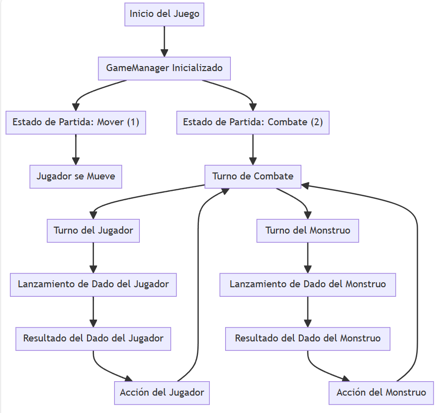
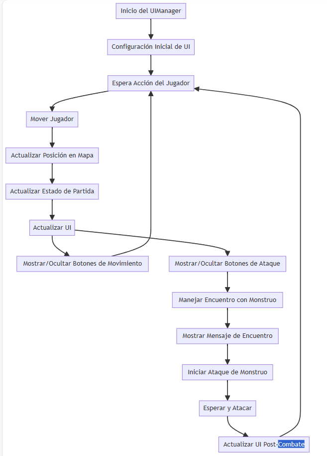
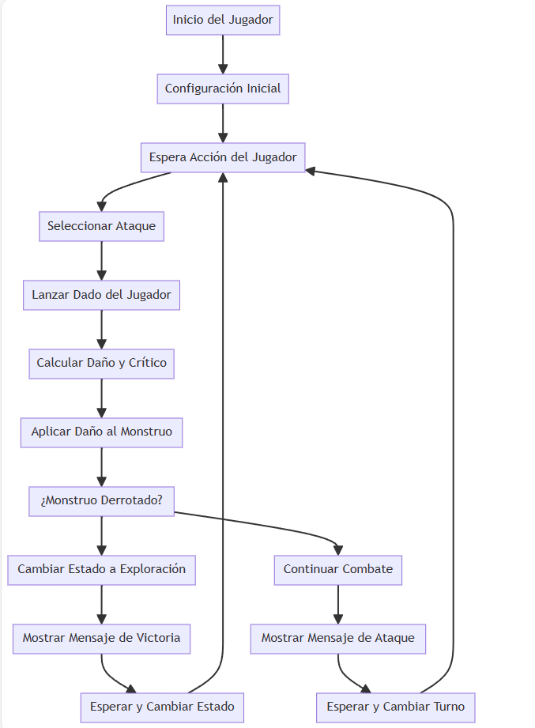
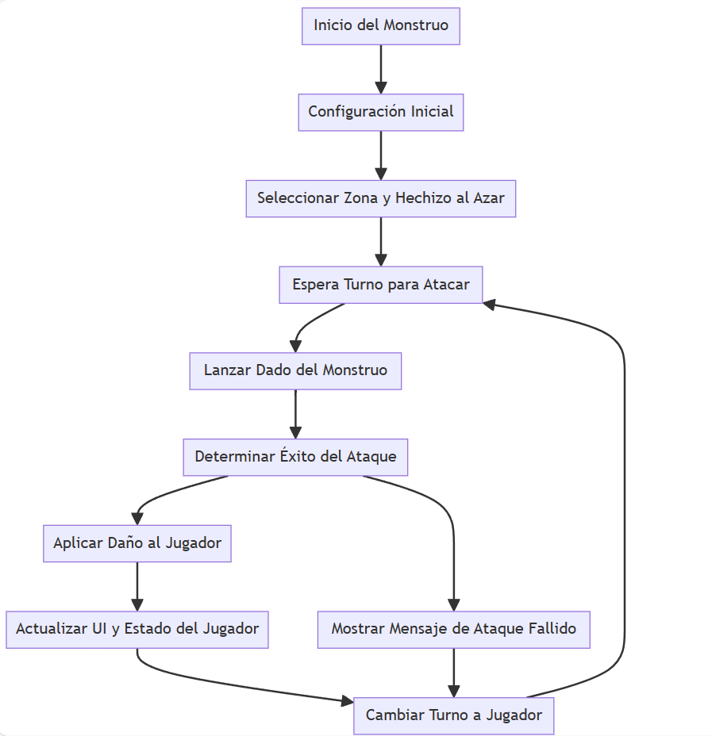

# MiniWakfu

Este juego es una mezcla de D&D y Wakfu, se juega en un tablero estilo juego de mesa, el jugador 
pasa por una serie de obstáculos para terminar la historia, que consiste en derrotar un monstruo
que está afectando esta, el juego termina cuando se derrota este Boss.

## Diagramas del Juego

A continuación, se presentan los diagramas clave que describen la lógica y el flujo del juego.

### Diagrama de GameManager

Este diagrama muestra cómo se gestiona el estado del juego y los turnos de combate.

[Ver diagrama completo de GameManager](https://showme.redstarplugin.com/d/d:JK5fEj4T)

### Diagrama de UIManager

Este diagrama ilustra cómo el `UIManager` gestiona la interfaz de usuario en el juego.

[Ver diagrama completo de UIManager](https://showme.redstarplugin.com/d/d:KI1ZHab6)

### Diagrama de Player

Este diagrama muestra cómo el jugador realiza acciones, como ataques, y cómo se manejan los turnos y el estado del juego.

[Ver diagrama completo de Player](https://showme.redstarplugin.com/d/d:RxdmkYFi)

### Diagrama de Monster

Este diagrama describe la lógica de los monstruos en el juego, incluyendo la selección de hechizos y la realización de ataques.

[Ver diagrama completo de Monster](https://showme.redstarplugin.com/d/d:7bGS1QfG)

## Cómo Jugar

Es un juego por turnos.

Empieza el jugador en la casilla de exploración, luego se le habilitaran los controles a la derecha para moverse en el mapa.

Cuando se encuentre en una casilla de monstruo estos controles de movimiento desaparecen y posteriormente se jugará por turnos contra un monstruo.

En el turno del jugador aparecen los controles de ataque.

Se sigue moviendo en el mapa hasta llegar al Jefe y derrotarlo.

## Créditos

(Fan Game) las imágenes [mapa, monstruos, jugador, monstruos] son propiedad de Ankama Games todos los derechos reservados.

Desarrollador: [S4g0g0](https://twitter.com/nosoy_hacker)
